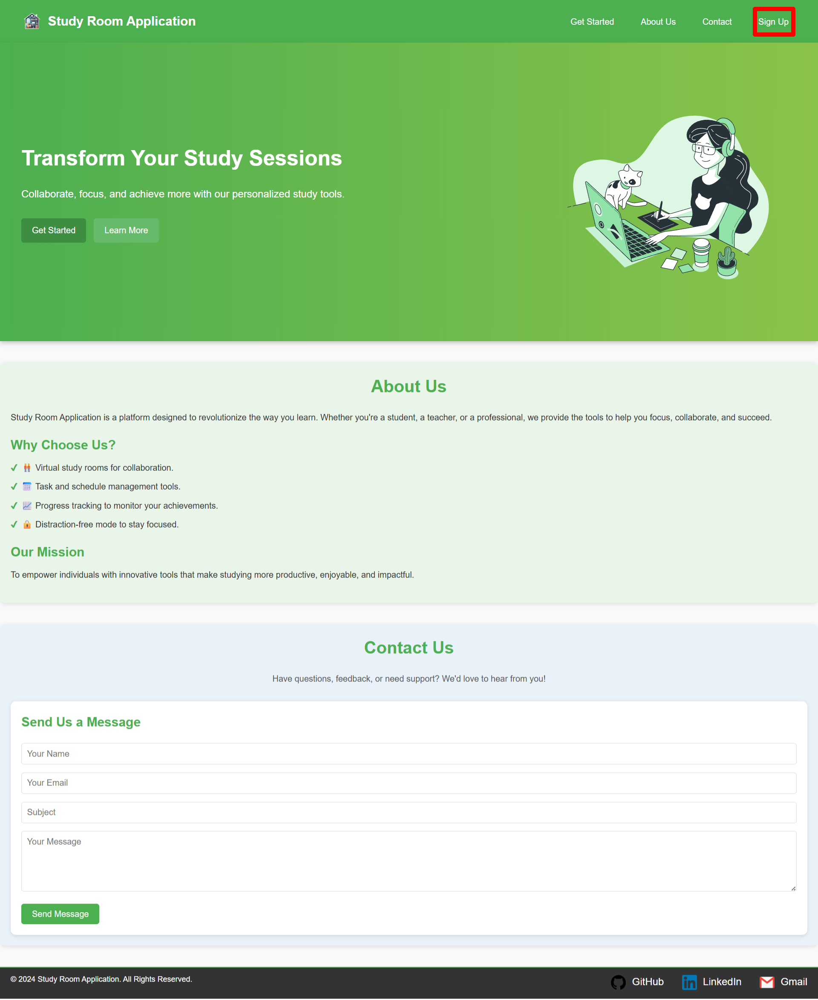
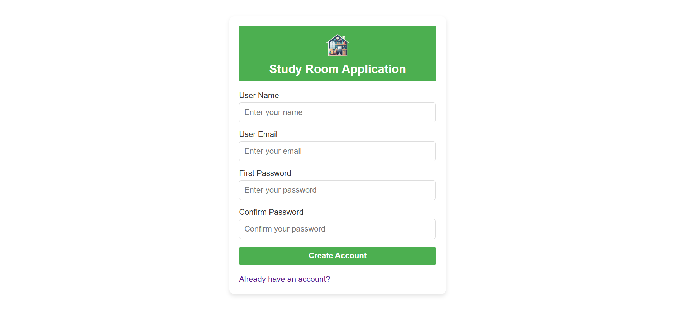
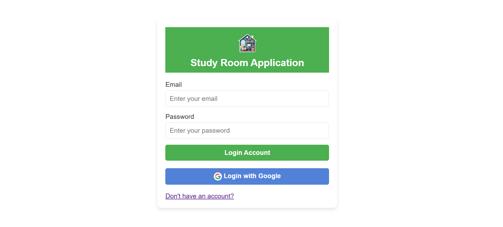
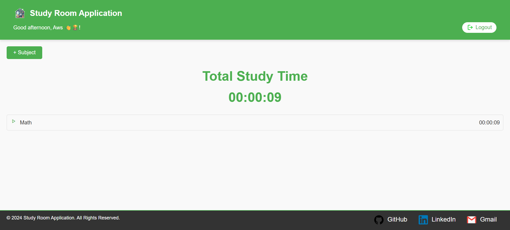

# 📚 Study Room Application

A simple web app for managing study sessions. Users can create an account, log in (including Google sign-in), add study subjects, and track study time with a timer.

---

## 🚀 Getting Started

### 🔄 Clone the Repository

```bash
git clone https://github.com/MariamHasanat/Study-Room-Application/tree/aws-nassar
cd study-room-app
```

### 💻 Run the Application

You can open the project directly in your browser:

```bash
Open index.html in your browser
```

> ℹ️ No additional setup or build process is required. Just ensure you have internet access for Firebase.

---

## 🔠 Landing Page Overview

When you open the application, you’ll see:

- ✅ Welcome message
- ✅ “Sign Up” and “Get Started” buttons
- ✅ Short description of what the app does:\
  *Organize your study time, track subjects, and stay focused.*

---

## 📝 How to Use

### 1️⃣ Create an Account

- Fill in:
  - User Name
  - Email
  - Password & Confirm Password
- Click the **Create Account** button.
- Your account will be created using Firebase Authentication.

### 2️⃣ Log In

- Go to the login page.
- Enter your email and password.
- Or click **Login with Google** to use Google sign-in.

---

## 🏠 Home Page Features

Once logged in, you’ll see the home/dashboard:

- ➕ **Add Subjects**
  - Add subjects you want to study.
- ⏱️ **Start Study Session**
  - Choose the subject.
  - Start the timer for a selected subject.
- ❌ **Cancel Study Session**
  - You can stop the timer anytime.

---

## 🔐 Authentication Options

- **Email & Password Login**
- **Google Account Login**

Both methods direct you to the same home page after login.

---

## 📷 Example Screens

- **Landing Page:**\


- **Sign-Up Page:**\


- **log-in Page:**\


- **Home Page:**\


- **Home Page:**\

---

## ⚙️ Built With

- Firebase Authentication
- Firebase Firestore
- HTML, CSS, JavaScript

---

Thank you for using Study Room Application! 🎓

